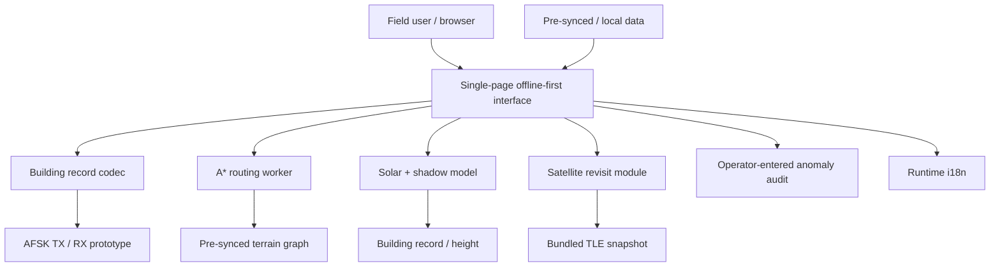

# Venezuela Earthquake Companion Desk — EMSR884

**Offline-first decision-support prototype for low-connectivity emergency scenarios.**

🌐 **[Live demo](https://vrkkao-eng.github.io/venezuela-earthquake-companion-desk/)**


This project explores how a browser-based field tool could continue to provide useful functions when connectivity is intermittent, bandwidth is constrained, and missing data must be made explicit rather than hidden behind plausible-looking output.

It is built around the **Copernicus EMSR884 Venezuela earthquake scenario** and complements, rather than replaces, official emergency-management products.

> **Safety note:** this is a research and portfolio prototype. It is not certified, operationally validated, or intended to direct real emergency-response decisions.

## What this project demonstrates

| Engineering area | Evidence in the repository |
| --- | --- |
| **Constraint-driven system design** | Modules are shaped around offline use, low bandwidth, explicit missing-data states, and operator-entered information |
| **Compact data representation** | Fixed-width 32-character building-record codec with signed coordinates, status, height, anomaly flag, and checksum handling |
| **Algorithmic routing** | A* pathfinding over a terrain graph with different cost models for infantry and armored modes |
| **Signal-processing prototype** | Bell-202-style AFSK waveform generation and offline TX→RX decoding tests |
| **Geospatial / physical modelling** | Solar-position and building-shadow calculations from location, date, time, and height |
| **Orbital calculation** | SGP4-based satellite-pass logic using a bundled Sentinel-1A TLE snapshot |
| **Human-in-the-loop design** | Anomaly flags are entered by operators; the project deliberately avoids social-media scraping |
| **Internationalisation** | Runtime UI switching across English, Spanish, French, Italian, and Chinese |
| **Testing discipline** | Behavioural tests for codec, routing, modem, solar/shadow, orbit state, and i18n modules |

## Architecture



The architecture deliberately avoids a server dependency for core runtime behaviour after the required data has been prepared locally.

## Design constraints

Three design decisions shape the repository:

1. **Offline-first means pre-synced data, not magical zero-network operation.**  
   Road graphs, TLE snapshots, building information, and other external inputs must be prepared before field use.

2. **Missing data stays visible.**  
   A module should expose an unavailable-data state rather than fabricate a countdown, coordinate, route, or confidence signal.

3. **Operator input stays distinguishable from external evidence.**  
   The anomaly-audit module uses manually entered flags and does not scrape Telegram, X/Twitter, or other social platforms.

These are design principles for the prototype, not evidence of operational emergency-response validation.

## Modules

| Module | Purpose | Verification evidence |
| --- | --- | --- |
| **Codec** | Encode/decode building assessments into a 32-character fixed-width wire format | Round-trip tests include signed coordinates, boundary values, anomaly flags, wrong length, and checksum corruption |
| **AFSK modem** | Convert a short text payload to/from an audio waveform | Offline generated-waveform → decoder round-trip tests; silence must fail preamble detection |
| **Digital twin / shadow** | Compute solar position and building-shadow geometry | Tests cover equinox/noon, winter sun, day/night state, and relative shadow length |
| **Routing** | Run A* against a terrain graph with mode-specific costs | Behavioural tests check known paths, damaged/blocked terrain, disconnected graphs, and mode divergence |
| **Satellite revisit** | Work with a bundled Sentinel-1A TLE and SGP4 logic | Tests explicitly check honest no-data behaviour and absence of fabricated countdown fields |
| **Anomaly audit** | Record operator-entered anomaly flags | Human-entered only; no social-media ingestion |
| **i18n** | Switch the UI between five languages | Dictionary/UI-binding tests are included |

## Higher-risk modules and verification boundary

The repository treats **routing** and the **building-record codec** as higher-risk components because incorrect output could have serious consequences if someone tried to use the prototype operationally.

Both include behavioural test suites, and the repository contains separate verifier-workflow pass markers under:

```text
.claude/verification/codec.pass
.claude/verification/routing.pass
```

These markers document a separate adversarial verification workflow used during development. They are **not third-party certification, independent safety validation, or evidence that the software is fit for field deployment**.

## 5-minute walkthrough

For a recruiter or technical reviewer, the fastest path through the project is:

1. Open the **[live demo](https://vrkkao-eng.github.io/venezuela-earthquake-companion-desk/)**.
2. Inspect `modules/codec/codec.js` and `codec.test.js` for the compact record / checksum design.
3. Inspect `modules/routing/routing-worker.js` and `routing.test.js` for the A* implementation and mode-dependent costs.
4. Inspect `modules/modem/` for the offline waveform round-trip prototype.
5. Inspect `modules/digital-twin/solar.js` and its tests for physical-model calculations.
6. Review `docs/data-contracts/` for explicit JSON schemas around building records, wire format, and routing graphs.

The project is most useful as evidence of **translating operational constraints into modular, testable software components**.

## Data contracts

The repository includes explicit schemas for:

- `docs/data-contracts/building-record.schema.json`
- `docs/data-contracts/codec-wire-format.schema.json`
- `docs/data-contracts/routing-graph.schema.json`

This keeps the interfaces between modules inspectable rather than relying only on implicit JavaScript object shapes.

## Running locally

```bash
python -m http.server 8080
# open http://localhost:8080
```

The browser application uses ES modules, so serving it over HTTP is more reliable than opening `index.html` directly with a `file://` URL.

## Satellite-data freshness

The satellite module uses a bundled TLE snapshot. TLE data is time-sensitive and should not be treated as indefinitely current.

To refresh the Sentinel-1A snapshot:

```bash
curl "https://tle.ivanstanojevic.me/api/tle/39634" \
  | jq -r '"SENTINEL-1A\n" + .line1 + "\n" + .line2' \
  > modules/orbit/data/tle-snapshot.txt
```

After refreshing, update the metadata comments in the snapshot file.

## Scope and limitations

This repository is intentionally a **prototype**, not an operational emergency-response system.

It has not been:

- certified for emergency use;
- independently safety-audited;
- integrated with official dispatch or command systems;
- validated against a real rescue-team workflow; or
- shown to meet any emergency-management standard.

The routing cost model is a prototype model. The modem tests use generated waveforms rather than field radio hardware. Satellite results depend on TLE freshness and model assumptions. Pre-synced datasets can become stale. Human-entered anomaly flags require human judgment.

The project should therefore be read as a systems-design and engineering portfolio artifact.

## Project origin and acknowledgement

The project was inspired by **[Yin-renlong](https://github.com/yin-renlong)** and his **[Venezuela Earthquake Copernicus Data Dashboard 2026](https://yin-renlong.github.io/venezuela-earthquake-copernicus-data-dashboard-2026/?aoi=12)**.

That dashboard prompted a different engineering question: what might a companion tool look like on the field side when connectivity cannot be assumed?

| Tool | Role |
| --- | --- |
| [Yin-renlong's damage-assessment map](https://yin-renlong.github.io/venezuela-earthquake-copernicus-data-dashboard-2026/?aoi=12) | Map / damage-assessment context |
| [This Companion Desk](https://vrkkao-eng.github.io/venezuela-earthquake-companion-desk/) | Offline-first field-side prototype |

## Engineering profile

See **[docs/engineering-profile.md](docs/engineering-profile.md)** for a concise recruiter-facing interpretation of the project, including a CV-ready description and the distinction between demonstrated capabilities and operational claims.

## License

Public domain / [CC0](https://creativecommons.org/publicdomain/zero/1.0/).
